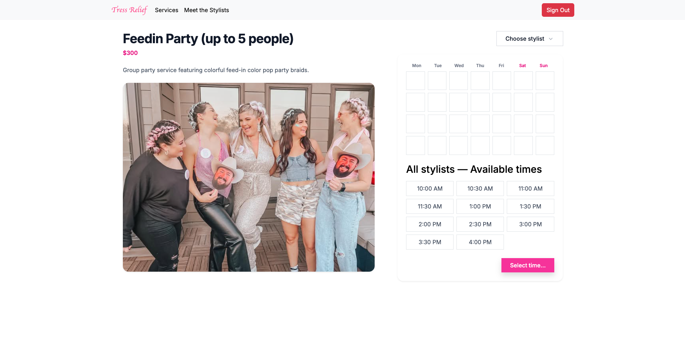
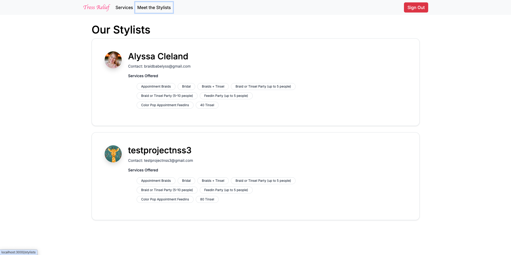

# Tress Relief

Tress Relief is a comprehensive hair salon management application that allows clients to browse hair services by category, view detailed service information, and explore stylists' portfolios. The app provides an intuitive interface for service discovery and includes administrative features for salon management including creating, editing, and deleting new servcices and managing which stylists offer them. 

## Overview

This Next.js application serves as the client-side interface for Tress Relief, a hair salon service management platform. It integrates with a Django REST API backend to provide a seamless experience for browsing hair services, viewing stylist information, and managing salon operations.

## Getting Started & Installation

### Prerequisites
- Node.js (v18 or higher)
- npm or yarn package manager
- Firebase account for authentication
- [Tress Relief Django backend](https://github.com/alyssacleland/tressrelief-server) running

### Setup Instructions

1. **Clone the repository**:
   ```bash
   git clone https://github.com/alyssacleland/tressrelief-client.git
   cd tressrelief-client
   ```

2. **Install dependencies**:
   ```bash
   npm install
   ```

3. **Set up environment variables**:
   Create a `.env.local` file in the root directory with:
   ```
   NEXT_PUBLIC_FIREBASE_API_KEY=your_api_key
   NEXT_PUBLIC_FIREBASE_AUTH_DOMAIN=your_domain
   NEXT_PUBLIC_DATABASE_URL=your_backend_api_url
   ```

4. **Start the development server**:
   ```bash
   npm run dev
   ```

5. **View the application**:
   Open [http://localhost:3000](http://localhost:3000) with your browser to see the application.

## About the User

**Primary User**: Hair salon clients and administrators

**Client Persona**: 
- Individuals seeking professional hair services
- Values visual browsing experience to see service examples
- Wants to understand service details, duration, and pricing before booking
- Interested in viewing stylist portfolios and expertise

**Admin Persona**:
- Salon owners and managers
- Needs to create, edit, and manage service offerings
- Wants to organize services by categories
- Requires tools to maintain accurate pricing and service information

## Features

- Browse hair services organized by categories (Braids, Feed-ins, Party styles, Tinsel, etc.)
- View detailed service information including descriptions, duration, and pricing
- Explore stylist profiles and their service specialties
- Firebase authentication for secure user management
- Administrative features for service and category management
- Create, edit, and delete services with form validation
- Multi-stylist assignment for services
- Real-time data updates from Django REST API backend

## Technology Stack

- **Frontend**: Next.js, React
- **Styling**: Tailwind CSS, React Bootstrap
- **Authentication**: Firebase Auth
- **Backend Integration**: RESTful API calls to Django backend

## Video Walkthrough of Tress Relief

Coming soon!

## Relevant Links

- [Backend Repository](https://github.com/alyssacleland/tressrelief-server)
- [ERD](https://dbdiagram.io/d/Tress-Relief-ERD-67b7b430263d6cf9a0ecdae3)
- [Project Proposal](https://docs.google.com/document/d/1Zs2dOnf_ZF1LuLe6OJZwOTR3j5Wer_WHPFdAxDB8WDs/edit?usp=sharing)


## Project Screenshots

### Categories Page


### Category Details/Services Page


### Service Details Page


### Stylists Page


### Create/Edit Service Form


## Contributors

- [Alyssa Cleland](https://github.com/alyssacleland)
