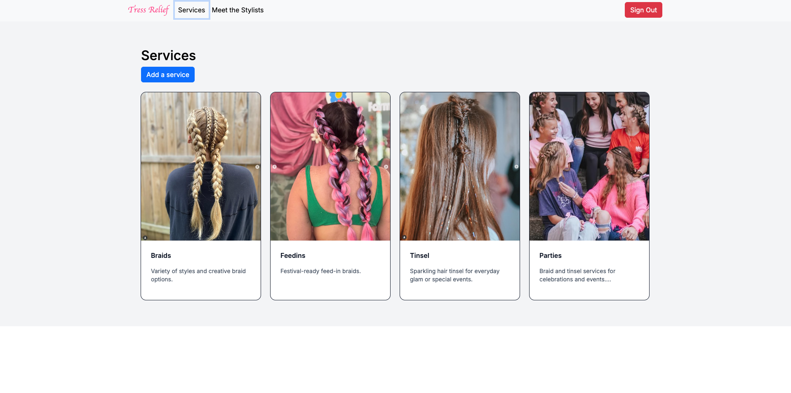
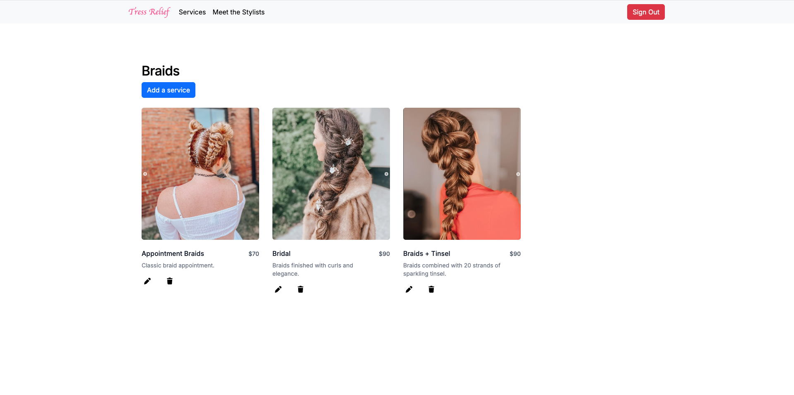
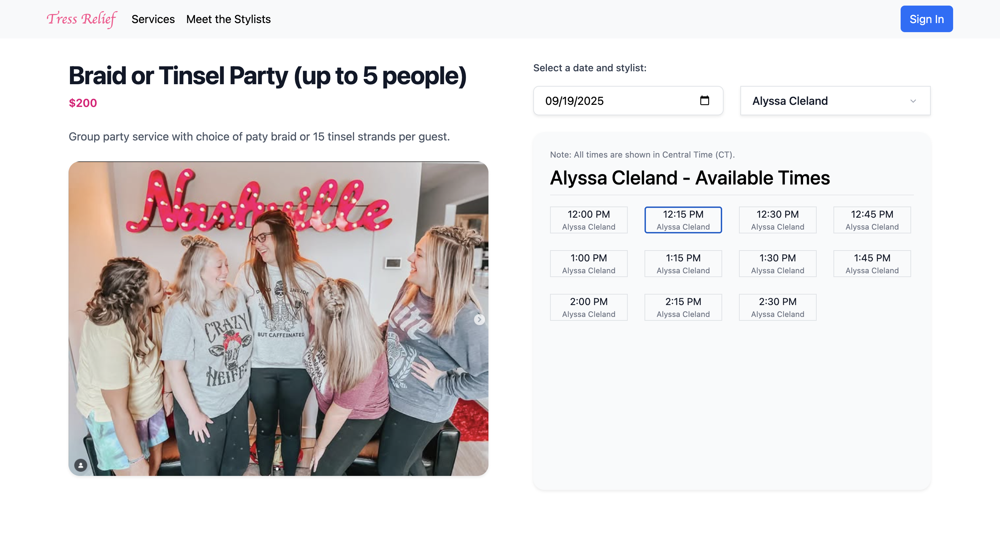
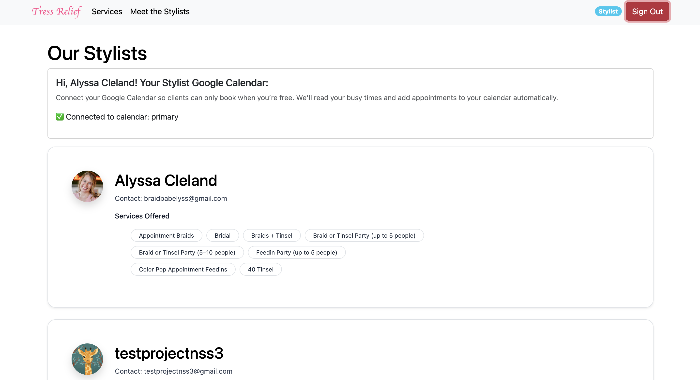
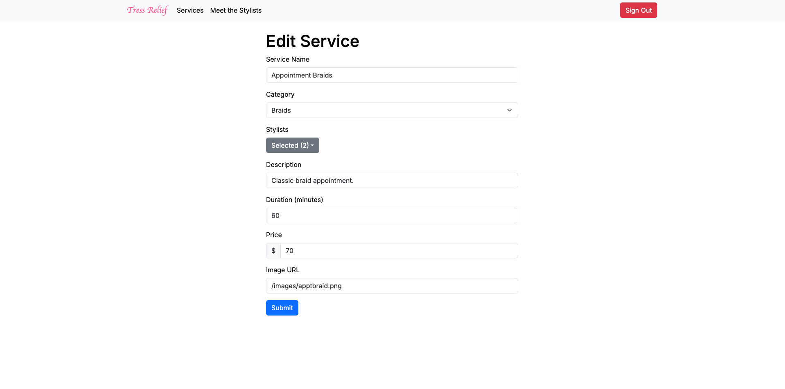

# Tress Relief

Tress Relief is a hair salon management application built with Next.js and Django. Clients can browse hair services by category, view detailed service information and appointment availability, and explore stylists. Administrators have full control over service management with the ability to create, update, and delete services and manage which stylists offer them. Stylists connect their Google Calendars for real-time availability checking via FreeBusy API and Google Calendar API. 

## Related Repositories

- **Backend Server**: [tressrelief-server](https://github.com/alyssacleland/tressrelief-server) - Python with Django backend


## User Roles & Access

The application supports three distinct user roles with different capabilities:

### **Clients** (Default Role)
- Browse services organized by categories
- View service details including pricing, duration, and descriptions
- Explore stylist profiles and what services they offer
- View real-time availability for services
- Filter availability by preferred stylist

### **Stylists**
- Connect Google Calendar to show availability to clients
- View services they're assigned to offer
- See their profile on the public stylists page
- OAuth integration for calendar synchronization
- Access all client features

### **Administrators**
- Full service management (create, edit, delete services)
- Assign multiple stylists to services
- Manage service categories, pricing, duration, etc.

## Features

### Service Discovery & Management
- Browse hair services organized by categories (Braids, Feed-ins, Party styles, Tinsel, etc.)
- Detailed service pages with descriptions, duration, pricing, and high-quality images
- Multi-stylist assignment system for services
- Category-based organization for easy navigation

### Stylist Management
- Comprehensive stylist profiles showing specialties and contact information
- Google Calendar integration for availability management
- Real-time synchronization with stylist schedules

### Appointment Scheduling
- Browse real-time available time slots based on stylist's Google Calendars
- Filter availability by specific stylist or view all stylists
- Coming soon: Appointment booking, updating, and cancellation 

### Authentication & Security
- Firebase Google OAuth authentication
- Role-based access control with automatic user creation
- Protected routes based on user permissions

### Administrative Tools
- Service creation and editing forms
- Dropdown multi-select for stylist assignments
- Service deletion with confirmation prompts

## Technology Stack

- **Frontend**: Next.js, React
- **Styling**: Tailwind CSS, React Bootstrap
- **Authentication**: Firebase Auth, Google OAuth
- **Calendar Integration**: Google Calendar API
- **Backend Integration**: RESTful API calls to Django backend

## Planned Features

The following features are in development:

- **Appointment Booking**: Complete the booking flow so clients can actually book appointments, not just view availability
- **Google Calendar Integration**: Automatically add confirmed appointments to stylist calendars
- **Client Calendar Options**: Let clients add appointments to their own Google Calendar or download ICS files
- **Email Notifications**: Send confirmation emails when appointments are booked
- **User Role Management**: Admin tools to promote users between client, stylist, and admin rolesx

## Video Walkthrough of Tress Relief

- [YouTube Video](https://www.youtube.com/watch?v=S2swTTe-KzA)

## Relevant Links

- [Backend Repository](https://github.com/alyssacleland/tressrelief-server)
- [ERD](https://dbdiagram.io/d/Tress-Relief-ERD-67b7b430263d6cf9a0ecdae3)


## Project Screenshots

### Categories Page


### Category Details/Services Page


### Service Details with Availability


### Stylists Page


### Create/Edit Service Form


## Contributors

- [Alyssa Cleland](https://github.com/alyssacleland)

## Getting Started & Installation

### Prerequisites
- Node.js (v18 or higher)
- npm or yarn package manager
- Firebase account for authentication
- [Tress Relief Django backend](https://github.com/alyssacleland/tressrelief-server) running

### Setup Instructions

1. **Clone the repository**:
   ```bash
   git clone https://github.com/alyssacleland/tressrelief-client.git
   cd tressrelief-client
   ```

2. **Install dependencies**:
   ```bash
   npm install
   ```

3. **Set up environment variables**:
   Create a `.env.local` file in the root directory with:
   ```
   NEXT_PUBLIC_FIREBASE_API_KEY=your_api_key
   NEXT_PUBLIC_FIREBASE_AUTH_DOMAIN=your_domain
   NEXT_PUBLIC_DATABASE_URL=your_backend_api_url
   NEXT_PUBLIC_API_BASE=your_backend_api_url
   ```

4. **Start the development server**:
   ```bash
   npm run dev
   ```

5. **View the application**:
   Open [http://localhost:3000](http://localhost:3000) with your browser to see the application.
